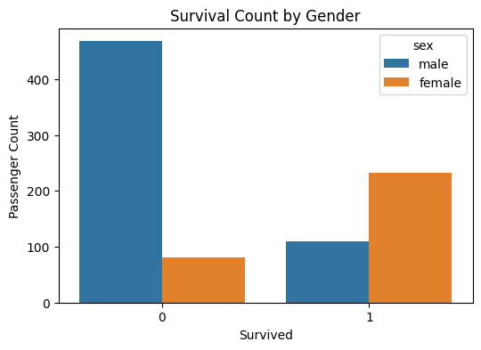
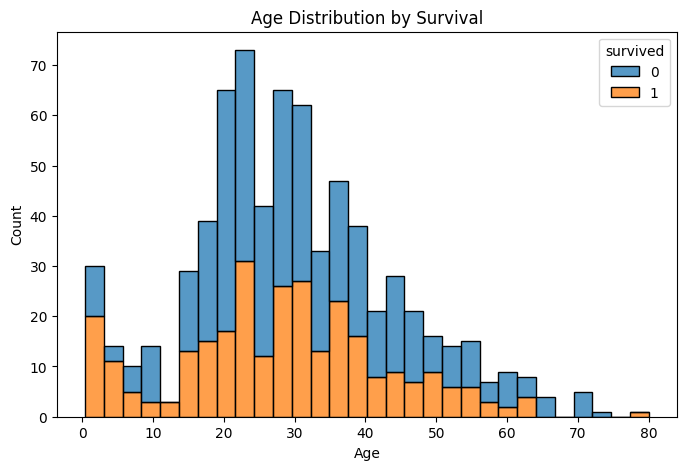
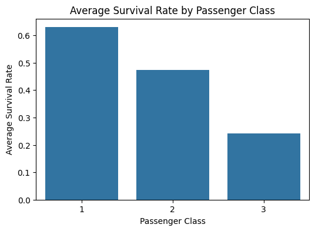
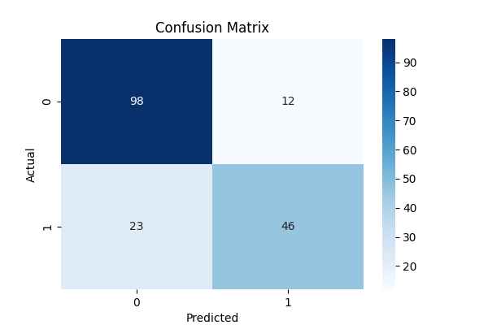
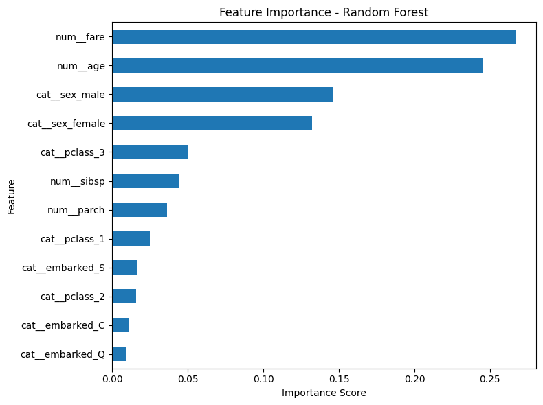

# Titanic ML Pipeline

An end-to-end Machine Learning pipeline project for predicting Titanic passenger survival using Scikit-learn, FastAPI, and model deployment best practices.

This project demonstrates:

* exploratory data analysis (EDA)
* feature engineering
* preprocessing pipelines
* model comparison
* classification evaluation
* model interpretability
* FastAPI deployment
* API validation and testing

---

# Project Overview

The goal of this project is to build a complete machine learning workflow for binary classification using the Titanic dataset.

The project covers the entire ML lifecycle:

* data exploration
* preprocessing
* model training
* evaluation
* deployment
* API serving
* testing

---

# Data Source

The dataset is loaded directly from Seaborn:

```python
import seaborn as sns

df = sns.load_dataset("titanic")
```

No local CSV file is required.

---

# Project Workflow

```text
Raw Data
↓
Exploratory Data Analysis
↓
Feature Selection
↓
Missing Value Handling
↓
Encoding & Scaling
↓
Train/Test Split
↓
Model Training
↓
Model Comparison
↓
Evaluation
↓
Feature Importance Analysis
↓
Model Serialization
↓
FastAPI Deployment
↓
API Testing
```

---

# Technologies Used

## Data Science & Machine Learning

* Python
* Pandas
* NumPy
* Scikit-learn
* XGBoost
* Seaborn
* Matplotlib

## Backend & Deployment

* FastAPI
* Uvicorn
* Pydantic
* Joblib

## Testing

* Pytest
* HTTPX

---

# Exploratory Data Analysis (EDA)

The notebook includes several exploratory visualizations to understand relationships between features and survival outcomes.

## Survival by Gender

Female passengers had significantly higher survival rates compared to male passengers.



---

## Age Distribution by Survival

The age distribution analysis shows that survival outcomes varied across all age groups, although younger passengers showed slightly higher survival tendencies.



---

## Survival by Passenger Class

Passengers in higher ticket classes had substantially higher survival probabilities.



---

# Machine Learning Pipeline

The project uses Scikit-learn Pipelines and ColumnTransformer to ensure clean preprocessing and prevent data leakage.

## Preprocessing Steps

### Numerical Features

* Missing value imputation using median
* Feature scaling using StandardScaler

### Categorical Features

* Missing value imputation using most frequent value
* One-hot encoding using OneHotEncoder

---

# Models Compared

| Model               | Accuracy | Precision | Recall | F1-Score | ROC-AUC |
| ------------------- | -------: | --------: | -----: | -------: | ------: |
| Logistic Regression |     0.80 |      0.79 |   0.67 |     0.72 |    0.84 |
| Random Forest       |     0.81 |      0.79 |   0.70 |     0.74 |    0.84 |
| XGBoost             |     0.80 |      0.76 |   0.72 |     0.74 |    0.81 |

---

# Class Imbalance Handling

To address class imbalance, Logistic Regression was retrained using:

```python
class_weight="balanced"
```

This approach improved minority-class sensitivity and helped the model better detect survival outcomes.

---

# Final Model Evaluation

The Logistic Regression model was selected as the final baseline model because it remained:

* interpretable
* lightweight
* fast
* deployment-friendly

Classification report observations:

* strong overall accuracy
* high precision for non-survival predictions
* lower recall for survival predictions
* evidence of class imbalance effects

---

# Confusion Matrix



---

# Feature Importance Analysis

Feature importance analysis was performed using the Random Forest model to improve interpretability.

The analysis showed that:

* fare
* age
* gender

were among the most influential features for survival prediction.



---

# FastAPI Deployment

The trained model was deployed using FastAPI.

The API supports:

* prediction requests
* input validation
* response schemas
* automatic Swagger documentation
* error handling

## Example Prediction Request

```json
{
  "pclass": 3,
  "sex": "male",
  "age": 22,
  "sibsp": 1,
  "parch": 0,
  "fare": 7.25,
  "embarked": "S"
}
```

## Example API Response

```json
{
  "survived": 0,
  "survival_probability": 0.0876
}
```

---

# API Validation Features

The API includes:

* enum validation
* numerical range validation
* structured response models
* HTTP exception handling

Example validations:

* `sex` must be `male` or `female`
* `embarked` must be `S`, `C`, or `Q`
* age cannot be negative

---

# API Testing

The project includes automated API tests using Pytest and FastAPI TestClient.

Test coverage includes:

* root endpoint testing
* valid prediction requests
* invalid input handling
* validation error testing

Run tests:

```bash
pytest
```

---

# Running the API

## Install dependencies

```bash
pip install -r requirements.txt
```

## Start the server

```bash
uvicorn src.main:app --reload
```

## Open Swagger Documentation

```text
http://127.0.0.1:8000/docs
```

---

# Repository Structure

```text
titanic-ml-pipeline/
│
├── images/
│   ├── age_distribution.png
│   ├── confusion_matrix.png
│   ├── feature_importance.png
│   ├── survival_by_class.png
│   └── survival_by_gender.png
│
├── notebook/
│   └── titanic_pipeline.ipynb
│
├── src/
│   ├── __init__.py
│   ├── main.py
│   └── titanic_model.pkl
│
├── tests/
│   └── test_api.py
│
├── README.md
├── requirements.txt
└── .gitignore
```

---

# Key Learning Outcomes

This project helped strengthen understanding of:

* end-to-end ML workflows
* preprocessing pipelines
* classification metrics
* model interpretability
* class imbalance handling
* FastAPI deployment
* API testing
* production-oriented ML engineering practices

---

# Future Improvements

* Hyperparameter tuning with GridSearchCV
* Cross-validation optimization
* Docker containerization
* CI/CD integration
* Cloud deployment
* MLflow experiment tracking
* Advanced monitoring and logging

---

# Author

**Melek Kuru**
